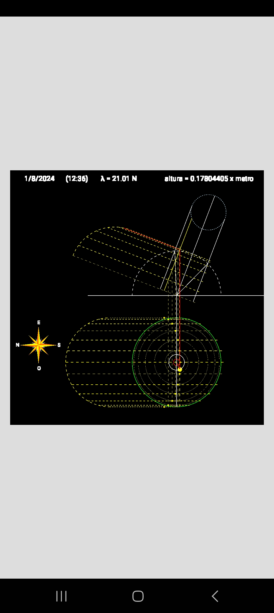

# Obtención de la sombra en una carta solar

*En memoria de Alejandra Torres Landa López*
[Gráfica solar](https://github.com/atorresl/representacion)

**Observaciones**

- Deslizar dedo en la mitad superior para cambiar la latitud.
- Deslizar dedo en el cuarto inferior izquierdo para cambiar la fecha.
- Presionar sobre el cuarto inferior derecho para cambiar hora (trayectoria del Sol).

Se incluye archivo .PDF con explicación.
